# Domain Logic

How a Figma comment becomes an AI audit reply.

## Producing an Audit

```mermaid
flowchart TD
    %% ── Inputs ──────────────────────────────────────────
    COMMENT["Figma Comment
    ─────────────────
    comment_id, message,
    parent_id, node_id,
    user_handle, file_key"]

    TRIGGER_CFG["Trigger Config
    ─────────────────
    keyword → skill_ref
    e.g. @ux → builtin:ux"]

    %% ── Trigger matching ────────────────────────────────
    COMMENT --> MATCH[match_trigger]
    TRIGGER_CFG --> MATCH
    MATCH -->|No keyword found| IGNORE([Ignored])
    MATCH -->|Match| TM

    TM["TriggerMatch
    ─────────────────
    trigger: Trigger
    extra: reviewer context"]

    %% ── Audit created ───────────────────────────────────
    COMMENT --> AUDIT
    TM --> AUDIT
    AUDIT["Audit ∎ aggregate root
    ──────────────────────
    audit_id, comment,
    trigger_match, status"]

    %% ── Skill resolution ────────────────────────────────
    AUDIT --> RESOLVE[Resolve skill_ref]
    RESOLVE --> SKILL_FILE

    SKILL_FILE["skill.md
    ─────────────────
    evaluation rubric
    + references/*.md"]

    %% ── Introspection ───────────────────────────────────
    SKILL_FILE --> INTROSPECT[Introspect skill]
    INTROSPECT --> REQ_DATA

    REQ_DATA["required_data
    ─────────────────
    e.g. screenshot,
    node_tree, text_nodes"]

    %% ── Figma data fetch ────────────────────────────────
    REQ_DATA --> FETCH[Fetch from Figma API]
    AUDIT --> FETCH

    FETCH --> DESIGN_DATA

    DESIGN_DATA["Design Data
    ─────────────────
    screenshot · node_tree
    text_nodes · styles
    components · variables
    annotations · prototype_flows
    dev_resources · file_structure"]

    %% ── Prompt assembly ─────────────────────────────────
    SKILL_FILE --> PROMPT[Build prompt]
    DESIGN_DATA --> PROMPT
    AUDIT --> PROMPT

    PROMPT --> ASSEMBLED

    ASSEMBLED["Assembled Prompt
    ─────────────────
    skill instructions
    + reference docs
    + frame name
    + trigger context
    + design data
    + output constraints"]

    %% ── AI call ─────────────────────────────────────────
    ASSEMBLED --> AI[AI Provider]
    AI --> RAW[Raw reply text]

    %% ── Post-processing ─────────────────────────────────
    RAW --> CLEAN[clean_reply]
    TRIGGER_CFG --> CLEAN
    CLEAN --> REPLY

    REPLY["Audit Reply
    ─────────────────
    🗣️ @ux Audit — Frame Name

    plain-text evaluation
    ≤4000 chars, no markdown,
    trigger words stripped

    — Provider Name"]

    %% ── Posted ──────────────────────────────────────────
    REPLY --> POST[Post to Figma as comment reply]

    %% ── Styling ─────────────────────────────────────────
    classDef input fill:#e8f4fd,stroke:#4a90d9
    classDef vo fill:#f0f0f0,stroke:#888
    classDef process fill:#fff,stroke:#333
    classDef output fill:#e8fde8,stroke:#4a9
    classDef discard fill:#fafafa,stroke:#ccc,color:#999

    class COMMENT,TRIGGER_CFG,SKILL_FILE,DESIGN_DATA input
    class TM,REQ_DATA,ASSEMBLED vo
    class MATCH,RESOLVE,INTROSPECT,FETCH,PROMPT,AI,CLEAN,POST process
    class AUDIT,REPLY output
    class IGNORE discard
```

### Key concepts

- **Trigger matching** is a pure function — lowercase keyword search against the comment message. The text after the keyword becomes `extra` context passed to the AI.
- **Skill introspection** determines what Figma data the skill needs. Builtin skills have hardcoded requirements; custom skills are analysed by a cheap AI model (Haiku/Flash) and cached by file mtime.
- **Design data** is fetched in parallel from the Figma REST API (up to 3 concurrent requests). Screenshots try progressively smaller sizes until under 3.75 MB.
- **Prompt assembly** embeds all data inline for API providers, or passes file paths for Claude CLI. Node tree JSON is capped at 40K characters.
- **clean_reply** strips trigger keywords from the output (prevents feedback loops) and truncates to 4900 characters (Figma comment limit).
