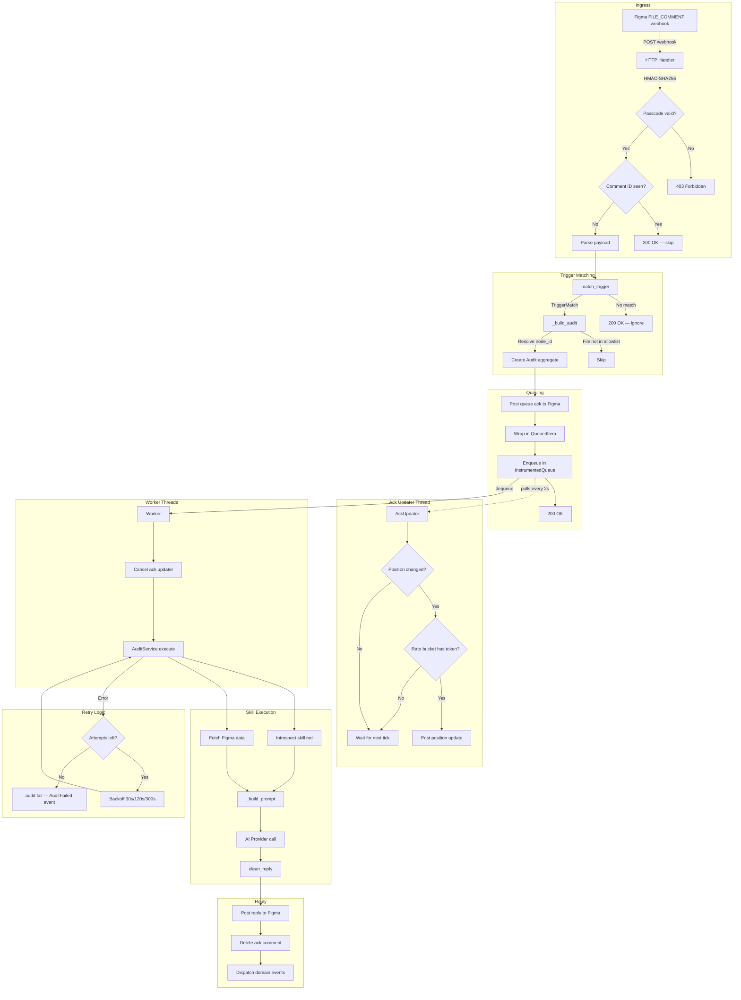
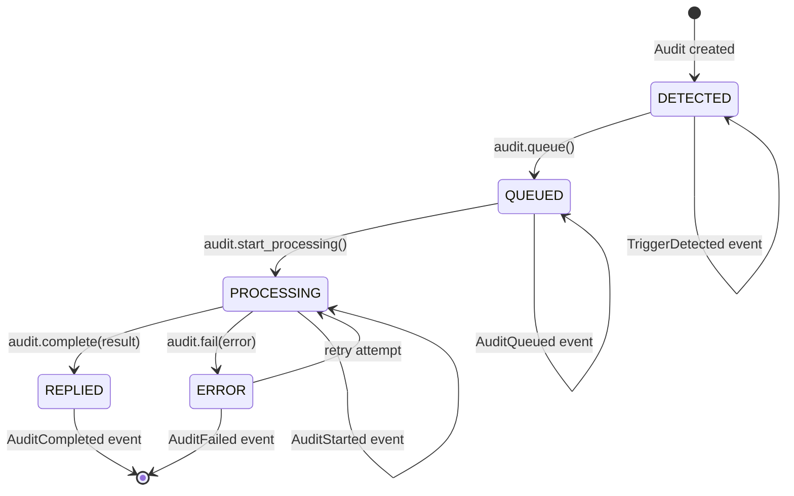
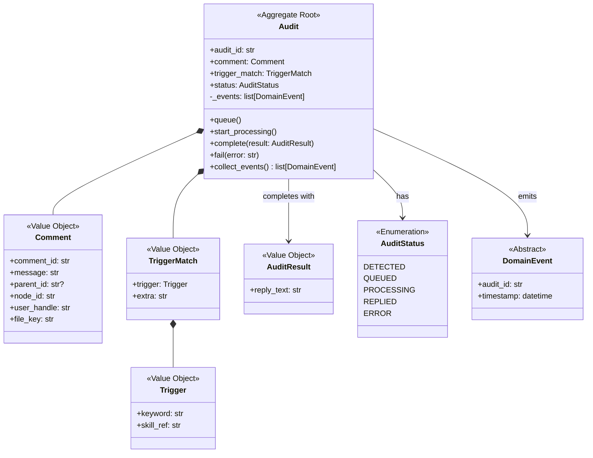
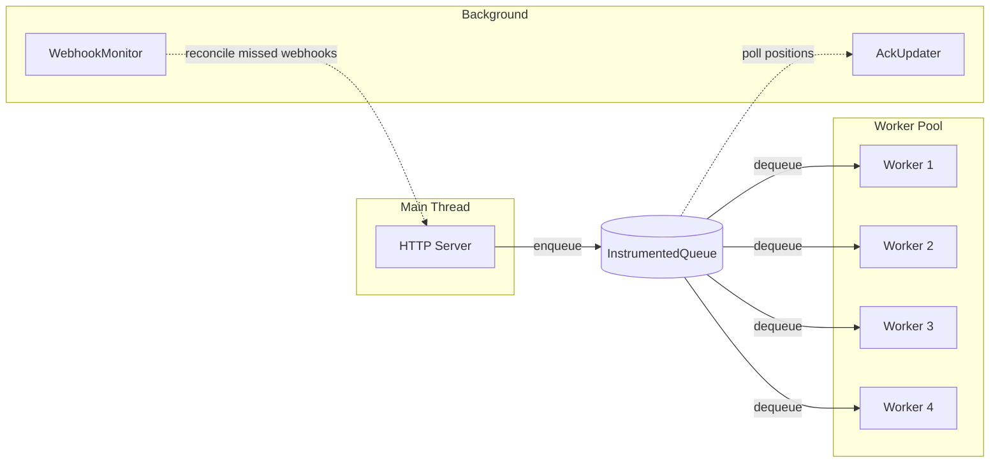
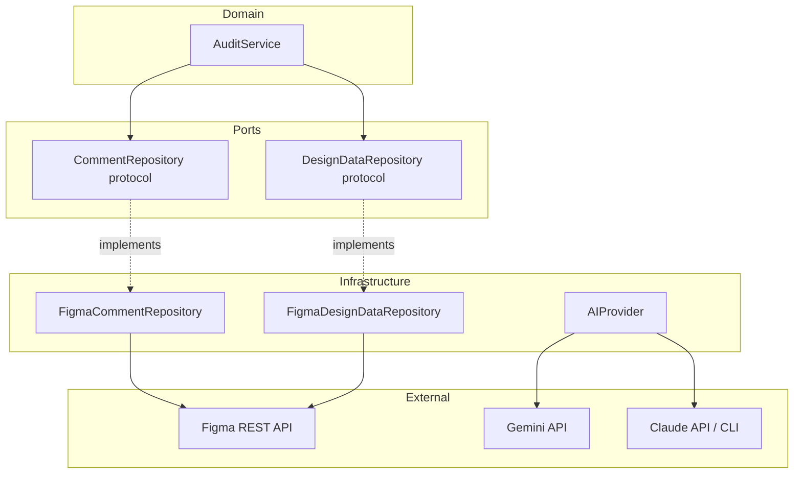

# Domain Logic

How a Figma comment becomes an AI audit reply.

## End-to-End Flow

```mermaid
flowchart TD
    subgraph Ingress
        A[Figma FILE_COMMENT webhook] -->|POST /webhook| B[HTTP Handler]
        B -->|HMAC-SHA256| C{Passcode valid?}
        C -->|No| D[403 Forbidden]
        C -->|Yes| E{Comment ID seen?}
        E -->|Yes| F[200 OK — skip]
        E -->|No| G[Parse payload]
    end

    subgraph Trigger Matching
        G --> H[match_trigger]
        H -->|No match| I[200 OK — ignore]
        H -->|TriggerMatch| J[_build_audit]
        J -->|File not in allowlist| K[Skip]
        J -->|Resolve node_id| L[Create Audit aggregate]
    end

    subgraph Queuing
        L --> M[Post queue ack to Figma]
        M --> N[Wrap in QueuedItem]
        N --> O[Enqueue in InstrumentedQueue]
        O --> P[200 OK]
    end

    subgraph Ack Updater Thread
        O -.->|polls every 2s| Q[AckUpdater]
        Q --> R{Position changed?}
        R -->|Yes| S{Rate bucket has token?}
        S -->|Yes| T[Post position update]
        S -->|No| U[Wait for next tick]
        R -->|No| U
    end

    subgraph Worker Threads
        O -->|dequeue| V[Worker]
        V --> W[Cancel ack updater]
        W --> X[AuditService.execute]
    end

    subgraph Skill Execution
        X --> Y[Introspect skill.md]
        X --> Z[Fetch Figma data]
        Y --> AA[_build_prompt]
        Z --> AA
        AA --> AB[AI Provider call]
        AB --> AC[clean_reply]
    end

    subgraph Reply
        AC --> AD[Post reply to Figma]
        AD --> AE[Delete ack comment]
        AE --> AF[Dispatch domain events]
    end

    subgraph Retry Logic
        X -->|Error| AG{Attempts left?}
        AG -->|Yes| AH[Backoff 30s/120s/300s]
        AH --> X
        AG -->|No| AI[audit.fail — AuditFailed event]
    end
```

## Audit Aggregate Lifecycle

```mermaid
stateDiagram-v2
    [*] --> DETECTED : Audit created
    DETECTED --> QUEUED : audit.queue()
    QUEUED --> PROCESSING : audit.start_processing()
    PROCESSING --> REPLIED : audit.complete(result)
    PROCESSING --> ERROR : audit.fail(error)
    ERROR --> PROCESSING : retry attempt

    DETECTED --> DETECTED : TriggerDetected event
    QUEUED --> QUEUED : AuditQueued event
    PROCESSING --> PROCESSING : AuditStarted event
    REPLIED --> [*] : AuditCompleted event
    ERROR --> [*] : AuditFailed event
```

## Domain Model

```mermaid
classDiagram
    class Audit {
        <<Aggregate Root>>
        +audit_id: str
        +comment: Comment
        +trigger_match: TriggerMatch
        +status: AuditStatus
        -_events: list[DomainEvent]
        +queue()
        +start_processing()
        +complete(result: AuditResult)
        +fail(error: str)
        +collect_events() list[DomainEvent]
    }

    class Comment {
        <<Value Object>>
        +comment_id: str
        +message: str
        +parent_id: str?
        +node_id: str
        +user_handle: str
        +file_key: str
    }

    class Trigger {
        <<Value Object>>
        +keyword: str
        +skill_ref: str
    }

    class TriggerMatch {
        <<Value Object>>
        +trigger: Trigger
        +extra: str
    }

    class AuditResult {
        <<Value Object>>
        +reply_text: str
    }

    class AuditStatus {
        <<Enumeration>>
        DETECTED
        QUEUED
        PROCESSING
        REPLIED
        ERROR
    }

    class DomainEvent {
        <<Abstract>>
        +audit_id: str
        +timestamp: datetime
    }

    Audit *-- Comment
    Audit *-- TriggerMatch
    TriggerMatch *-- Trigger
    Audit --> AuditResult : completes with
    Audit --> AuditStatus : has
    Audit --> DomainEvent : emits
```

## Threading Model

```mermaid
flowchart LR
    subgraph Main Thread
        HTTP[HTTP Server]
    end

    subgraph Worker Pool
        W1[Worker 1]
        W2[Worker 2]
        W3[Worker 3]
        W4[Worker 4]
    end

    subgraph Background
        ACK[AckUpdater]
        MON[WebhookMonitor]
    end

    Q[(InstrumentedQueue)]

    HTTP -->|enqueue| Q
    Q -->|dequeue| W1
    Q -->|dequeue| W2
    Q -->|dequeue| W3
    Q -->|dequeue| W4
    Q -.->|poll positions| ACK
    MON -.->|reconcile missed webhooks| HTTP
```

## Repository Boundaries

```mermaid
flowchart TD
    subgraph Domain
        AS[AuditService]
    end

    subgraph Ports
        CR[CommentRepository protocol]
        DR[DesignDataRepository protocol]
    end

    subgraph Infrastructure
        FCR[FigmaCommentRepository]
        FDR[FigmaDesignDataRepository]
        AIP[AIProvider]
    end

    subgraph External
        FAPI[Figma REST API]
        GEM[Gemini API]
        CLA[Claude API / CLI]
    end

    AS --> CR
    AS --> DR
    CR -.->|implements| FCR
    DR -.->|implements| FDR
    FCR --> FAPI
    FDR --> FAPI
    AIP --> GEM
    AIP --> CLA
```
